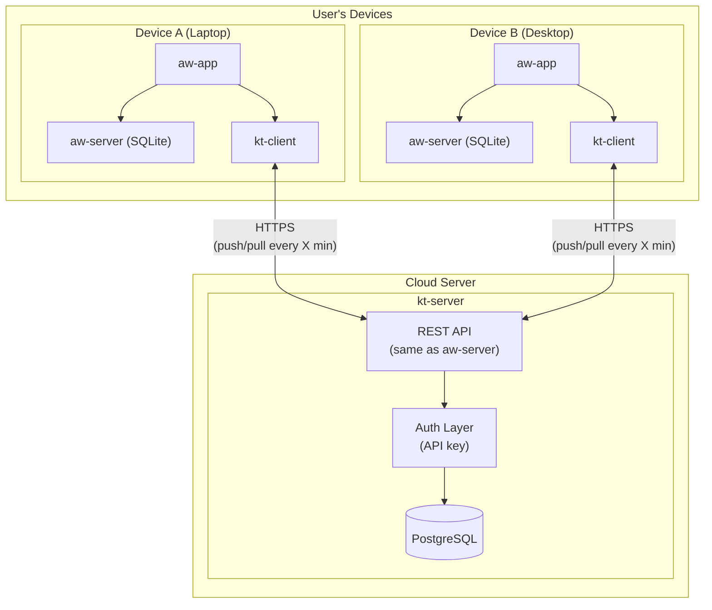
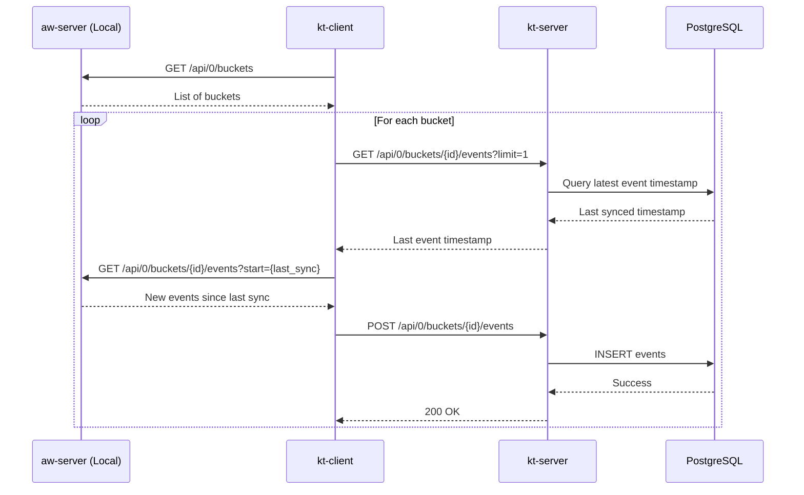
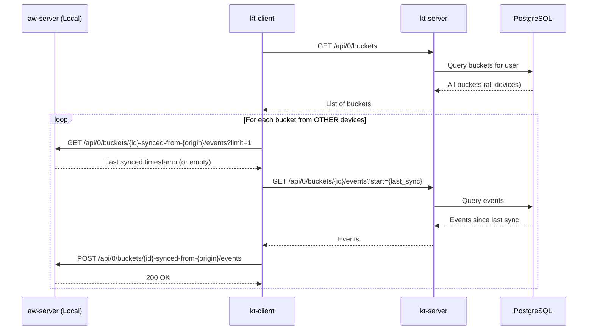
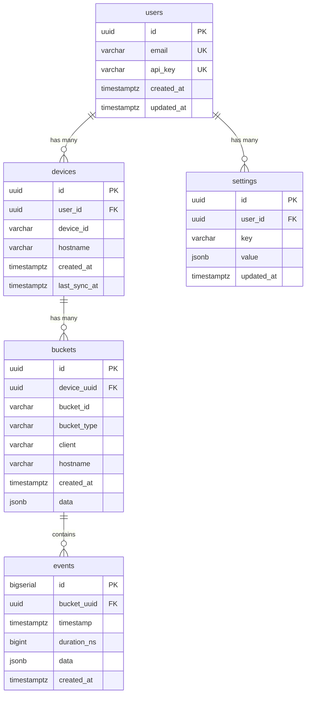
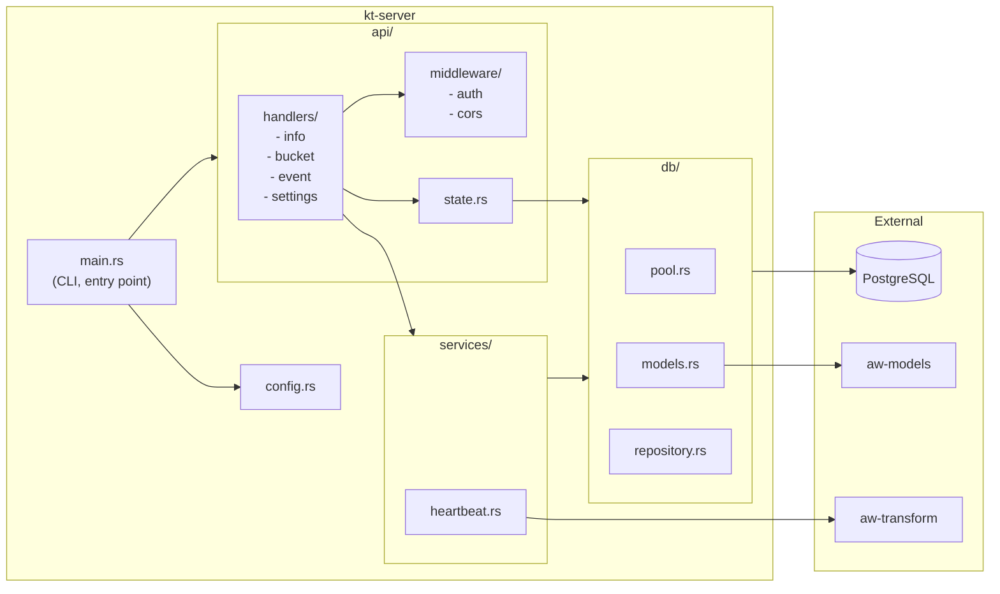
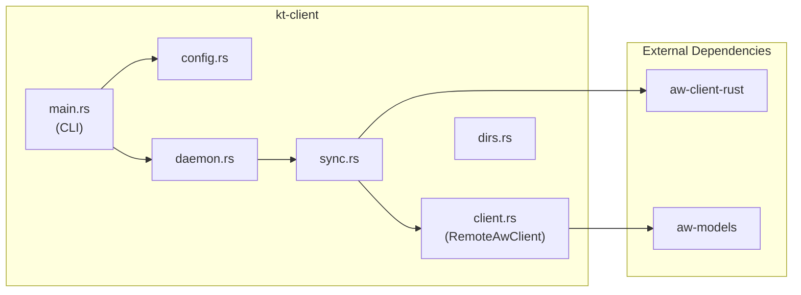

# kt-server & kt-client Implementation Plan

## Overview

This document outlines the implementation plan for two new components:

| Component | Location | Purpose |
|-----------|----------|---------|
| `kt-server` | `/kt-server/` | Remote server with PostgreSQL, same API as aw-server-rust (Komu Tracker Server) |
| `kt-client` | `/aw-server-rust/kt-client/` | Sync module that pushes/pulls data to/from remote server (Komu Tracker Client) |

## Architecture

### High-Level Overview



### Data Flow - Push Sync



### Data Flow - Pull Sync



### Database Schema



### Component Architecture





---

## Part 1: kt-server

### 1.1 Project Structure

```
/kt-server/
├── Cargo.toml
├── .env.example
├── Dockerfile
├── docker-compose.yml
├── migrations/
│   └── 20240107000001_create_tables.sql
└── src/
    ├── main.rs                 # Entry point, CLI
    ├── lib.rs                  # Library exports
    ├── config.rs               # Configuration from env/file
    ├── error.rs                # Error types (thiserror)
    ├── db/
    │   ├── mod.rs
    │   ├── pool.rs             # SQLx PostgreSQL pool
    │   ├── models.rs           # DB models (User, Device, Bucket, Event)
    │   └── repository.rs       # CRUD operations
    ├── api/
    │   ├── mod.rs
    │   ├── state.rs            # Shared app state
    │   ├── extractors.rs       # Custom Axum extractors (auth, device)
    │   ├── handlers/
    │   │   ├── mod.rs
    │   │   ├── info.rs         # GET /api/0/info
    │   │   ├── bucket.rs       # Bucket CRUD
    │   │   ├── event.rs        # Event CRUD, heartbeat
    │   │   ├── query.rs        # Query endpoint
    │   │   ├── import.rs       # Import
    │   │   ├── export.rs       # Export
    │   │   └── settings.rs     # Settings CRUD
    │   └── middleware/
    │       ├── mod.rs
    │       ├── auth.rs         # API key auth
    │       └── cors.rs         # CORS
    └── services/
        ├── mod.rs
        └── heartbeat.rs        # Heartbeat merge logic
```

### 1.2 Dependencies (Cargo.toml)

```toml
[package]
name = "kt-server"
version = "0.1.0"
edition = "2021"

[[bin]]
name = "kt-server"
path = "src/main.rs"

[dependencies]
# Web framework
axum = { version = "0.7", features = ["macros"] }
tower = "0.4"
tower-http = { version = "0.5", features = ["cors", "trace"] }

# Database
sqlx = { version = "0.7", features = ["runtime-tokio", "postgres", "chrono", "json", "uuid", "migrate"] }

# Reuse existing models
aw-models = { path = "aw-server-rust/aw-models" }
aw-transform = { path = "aw-server-rust/aw-transform" }  # For heartbeat logic

# Serialization
serde = { version = "1.0", features = ["derive"] }
serde_json = "1.0"

# Async
tokio = { version = "1", features = ["full"] }

# Utils
chrono = { version = "0.4", features = ["serde"] }
uuid = { version = "1", features = ["v4", "serde"] }
dotenvy = "0.15"
tracing = "0.1"
tracing-subscriber = { version = "0.3", features = ["env-filter"] }
clap = { version = "4", features = ["derive", "env"] }
thiserror = "1.0"
```

### 1.3 PostgreSQL Schema

```sql
-- migrations/20240107000001_create_tables.sql

-- Users table (simple for now, OAuth later)
CREATE TABLE users (
    id UUID PRIMARY KEY DEFAULT gen_random_uuid(),
    email VARCHAR(255) UNIQUE,
    api_key VARCHAR(64) UNIQUE NOT NULL,
    created_at TIMESTAMPTZ NOT NULL DEFAULT NOW(),
    updated_at TIMESTAMPTZ NOT NULL DEFAULT NOW()
);

-- Devices table (one user can have multiple devices)
CREATE TABLE devices (
    id UUID PRIMARY KEY DEFAULT gen_random_uuid(),
    user_id UUID NOT NULL REFERENCES users(id) ON DELETE CASCADE,
    device_id VARCHAR(255) NOT NULL,      -- Original aw device_id (e.g., "abc123")
    hostname VARCHAR(255) NOT NULL,        -- Machine hostname
    created_at TIMESTAMPTZ NOT NULL DEFAULT NOW(),
    last_sync_at TIMESTAMPTZ,
    UNIQUE(user_id, device_id)
);

-- Buckets table
CREATE TABLE buckets (
    id UUID PRIMARY KEY DEFAULT gen_random_uuid(),
    device_uuid UUID NOT NULL REFERENCES devices(id) ON DELETE CASCADE,
    bucket_id VARCHAR(255) NOT NULL,       -- e.g., "aw-watcher-window_hostname"
    bucket_type VARCHAR(255) NOT NULL,     -- e.g., "currentwindow"
    client VARCHAR(255) NOT NULL,          -- e.g., "aw-watcher-window"
    hostname VARCHAR(255) NOT NULL,
    created_at TIMESTAMPTZ NOT NULL,
    data JSONB NOT NULL DEFAULT '{}',
    UNIQUE(device_uuid, bucket_id)
);

-- Events table
CREATE TABLE events (
    id BIGSERIAL PRIMARY KEY,
    bucket_uuid UUID NOT NULL REFERENCES buckets(id) ON DELETE CASCADE,
    timestamp TIMESTAMPTZ NOT NULL,
    duration_ns BIGINT NOT NULL DEFAULT 0,
    data JSONB NOT NULL,
    created_at TIMESTAMPTZ NOT NULL DEFAULT NOW()
);

-- Settings table (per user)
CREATE TABLE settings (
    id UUID PRIMARY KEY DEFAULT gen_random_uuid(),
    user_id UUID NOT NULL REFERENCES users(id) ON DELETE CASCADE,
    key VARCHAR(255) NOT NULL,
    value JSONB,
    updated_at TIMESTAMPTZ NOT NULL DEFAULT NOW(),
    UNIQUE(user_id, key)
);

-- Indexes
CREATE INDEX idx_devices_user_id ON devices(user_id);
CREATE INDEX idx_buckets_device_uuid ON buckets(device_uuid);
CREATE INDEX idx_events_bucket_uuid ON events(bucket_uuid);
CREATE INDEX idx_events_timestamp ON events(timestamp);
CREATE INDEX idx_events_bucket_timestamp ON events(bucket_uuid, timestamp DESC);
CREATE INDEX idx_settings_user_id ON settings(user_id);
```

### 1.4 API Endpoints

All endpoints match `aw-server-rust` API, with added authentication:

| Endpoint | Method | Auth | Description |
|----------|--------|------|-------------|
| `GET /api/0/info` | GET | No | Server info |
| `GET /api/0/buckets/` | GET | Yes | List user's buckets (all devices) |
| `GET /api/0/buckets/:id` | GET | Yes | Get bucket |
| `POST /api/0/buckets/:id` | POST | Yes | Create bucket |
| `DELETE /api/0/buckets/:id` | DELETE | Yes | Delete bucket |
| `GET /api/0/buckets/:id/events` | GET | Yes | Get events (`?start=&end=&limit=`) |
| `POST /api/0/buckets/:id/events` | POST | Yes | Insert events |
| `GET /api/0/buckets/:id/events/count` | GET | Yes | Count events |
| `GET /api/0/buckets/:id/events/:eid` | GET | Yes | Get single event |
| `DELETE /api/0/buckets/:id/events/:eid` | DELETE | Yes | Delete event |
| `POST /api/0/buckets/:id/heartbeat` | POST | Yes | Heartbeat (`?pulsetime=`) |
| `GET /api/0/buckets/:id/export` | GET | Yes | Export bucket |
| `POST /api/0/query` | POST | Yes | Query (simplified initially) |
| `POST /api/0/import` | POST | Yes | Import buckets |
| `GET /api/0/export` | GET | Yes | Export all buckets |
| `GET /api/0/settings/` | GET | Yes | Get all settings |
| `GET /api/0/settings/:key` | GET | Yes | Get setting |
| `POST /api/0/settings/:key` | POST | Yes | Set setting |
| `DELETE /api/0/settings/:key` | DELETE | Yes | Delete setting |

**Additional sync endpoints:**

| Endpoint | Method | Description |
|----------|--------|-------------|
| `POST /api/0/devices/register` | POST | Register device (returns device UUID) |
| `GET /api/0/devices` | GET | List user's devices |

### 1.5 Authentication

Simple API key authentication:

```
Header: Authorization: Bearer <api_key>
# or
Header: X-API-Key: <api_key>
```

---

## Part 2: kt-client

### 2.1 Project Structure

```
/aw-server-rust/kt-client/
├── Cargo.toml
└── src/
    ├── main.rs           # CLI entry point
    ├── lib.rs            # Library exports
    ├── config.rs         # Configuration (remote URL, API key, etc.)
    ├── client.rs         # RemoteAwClient - HTTP client for kt-server
    ├── sync.rs           # Sync logic
    ├── daemon.rs         # Daemon mode with scheduler
    └── dirs.rs           # Config/data directories
```

### 2.2 Dependencies (Cargo.toml)

```toml
[package]
name = "kt-client"
version = "0.1.0"
edition = "2021"

[lib]
name = "kt_client"
path = "src/lib.rs"

[[bin]]
name = "kt-client"
path = "src/main.rs"

[dependencies]
log = "0.4"
fern = { version = "0.7", features = ["colored"] }
chrono = { version = "0.4", features = ["serde"] }
serde = { version = "1.0", features = ["derive"] }
serde_json = "1.0"
toml = "0.8"
reqwest = { version = "0.11", features = ["json", "blocking"] }
clap = { version = "4.1", features = ["derive"] }
dirs = "6.0.0"
gethostname = "0.4.3"
ctrlc = "3.4.5"
thiserror = "1.0"

# Reuse from workspace
aw-models = { path = "../aw-models" }
aw-client-rust = { path = "../aw-client-rust" }

[target.'cfg(target_os="linux")'.dependencies]
openssl = { version = "0.10.64", features = ["vendored"] }
```

### 2.3 Configuration

Config file location: `~/.config/activitywatch/kt-client/config.toml`

```toml
[remote]
url = "https://your-server.com"
api_key = "your-api-key"

[sync]
interval_minutes = 5
mode = "both"           # "push", "pull", "both"
buckets = ["*"]         # or specific: ["aw-watcher-window_host", "aw-watcher-afk_host"]

[local]
port = 5600             # Local aw-server port
```

### 2.4 CLI Interface

```bash
# Daemon mode (default) - sync every X minutes
kt-client daemon

# One-time sync
kt-client sync
kt-client sync --mode push
kt-client sync --mode pull

# List buckets (local and remote)
kt-client list

# Setup/config
kt-client setup --url https://server.com --api-key xxx
```

### 2.5 Sync Logic

```rust
// Pseudo-code for sync flow

pub fn sync_run(mode: SyncMode, config: &Config) -> Result<()> {
    let local_client = AwClient::new("localhost", config.local.port, "kt-client")?;
    let remote_client = RemoteAwClient::new(&config.remote.url, &config.remote.api_key)?;
    
    // Register device if not already registered
    remote_client.register_device_if_needed(&local_client.get_info()?.device_id)?;
    
    if mode == Push || mode == Both {
        // Push: local -> remote
        push_to_remote(&local_client, &remote_client, &config)?;
    }
    
    if mode == Pull || mode == Both {
        // Pull: remote (other devices) -> local
        pull_from_remote(&remote_client, &local_client, &config)?;
    }
    
    Ok(())
}

fn push_to_remote(local: &AwClient, remote: &RemoteAwClient, config: &Config) -> Result<()> {
    let local_buckets = local.get_buckets()?;
    
    for bucket in local_buckets.values() {
        if !should_sync_bucket(bucket, &config.sync.buckets) {
            continue;
        }
        
        // Get or create remote bucket
        let remote_bucket = remote.get_or_create_bucket(bucket)?;
        
        // Get last synced timestamp (from most recent event on remote)
        let last_sync = get_most_recent_event_timestamp(remote, &remote_bucket.id)?;
        
        // Fetch new events from local since last sync
        let events = local.get_events(&bucket.id, last_sync, None, None)?;
        
        if !events.is_empty() {
            // Insert to remote in batches of 5000
            for chunk in events.chunks(5000) {
                remote.insert_events(&remote_bucket.id, chunk.to_vec())?;
            }
            info!("Pushed {} events for bucket {}", events.len(), bucket.id);
        }
    }
    Ok(())
}

fn pull_from_remote(remote: &RemoteAwClient, local: &AwClient, config: &Config) -> Result<()> {
    let remote_buckets = remote.get_buckets()?;
    let local_device_id = local.get_info()?.device_id;
    
    for bucket in remote_buckets.values() {
        // Skip buckets from this device (avoid duplicating local data)
        if bucket_is_from_device(bucket, &local_device_id) {
            continue;
        }
        
        // Create local bucket with "-synced-from-{origin}" suffix
        let local_bucket_id = format!("{}-synced-from-{}", bucket.id, bucket.hostname);
        let local_bucket = local.get_or_create_bucket(&local_bucket_id, bucket)?;
        
        // Get last synced timestamp
        let last_sync = get_most_recent_event_timestamp(local, &local_bucket_id)?;
        
        // Fetch new events from remote
        let events = remote.get_events(&bucket.id, last_sync, None, None)?;
        
        if !events.is_empty() {
            for chunk in events.chunks(5000) {
                local.insert_events(&local_bucket_id, chunk.to_vec())?;
            }
            info!("Pulled {} events for bucket {}", events.len(), local_bucket_id);
        }
    }
    Ok(())
}
```

---

## Part 3: Integration with aw-app

### 3.1 Update Workspace

Add `kt-client` to `/aw-server-rust/Cargo.toml`:

```toml
[workspace]
members = [
    "aw-client-rust",
    "aw-datastore",
    "aw-models",
    "aw-transform",
    "aw-server",
    "aw-sync",
    "kt-client",  # NEW
    "aw-query",
]
```

### 3.2 aw-app Configuration

Users can add to their `~/.config/activitywatch/aw-app/config.toml`:

```toml
[autostart]
modules = [
    "aw-watcher-afk",
    "aw-watcher-window",
    { name = "aw-sync", args = "daemon" },
    { name = "kt-client", args = "daemon" },  # NEW
]
```

---

## Part 4: Implementation Order

| Phase | Step | Description | Est. Hours |
|-------|------|-------------|------------|
| **1** | 1.1 | Create `kt-server` project scaffold | 1 |
| | 1.2 | Set up PostgreSQL with SQLx, create migrations | 2 |
| | 1.3 | Implement DB repository layer (CRUD) | 3 |
| | 1.4 | Implement API handlers (info, buckets, events) | 4 |
| | 1.5 | Implement heartbeat logic | 1 |
| | 1.6 | Add API key authentication middleware | 1 |
| | 1.7 | Add import/export endpoints | 2 |
| | 1.8 | Add settings endpoints | 1 |
| | 1.9 | Docker setup | 1 |
| **2** | 2.1 | Create `kt-client` project scaffold | 1 |
| | 2.2 | Implement `RemoteAwClient` | 2 |
| | 2.3 | Implement push sync logic | 2 |
| | 2.4 | Implement pull sync logic | 2 |
| | 2.5 | Implement daemon mode | 1 |
| | 2.6 | CLI and configuration | 1 |
| **3** | 3.1 | Integration testing | 2 |
| | 3.2 | Documentation | 1 |

**Total estimated: ~25 hours**

---

## Open Questions

### 1. Query Endpoint

The `/api/0/query` endpoint in aw-server-rust uses a custom query language (`aw-query`). Options:

- **Option A**: Skip this endpoint initially (return "not implemented")
- **Option B**: Implement a simplified version
- **Option C**: Port `aw-query` to work with PostgreSQL

**Recommendation**: Start with Option A, implement later if needed.

### 2. Bucket Filtering for Pull

When pulling from remote, options:

- **Option A**: Pull ALL buckets from other devices
- **Option B**: Allow configuring which bucket types to pull
- **Option C**: Only pull buckets with matching types to local buckets

**Recommendation**: Option A (pull all), with bucket filter in config.

### 3. API Key Generation

How should users get their API key?

- **Option A**: CLI command: `kt-server generate-key --email user@example.com`
- **Option B**: Manual database insert for now
- **Option C**: Web UI (future)

**Recommendation**: Option A for now.

### 4. Error Handling on Sync Failure

If sync fails mid-way:

- **Option A**: Retry immediately
- **Option B**: Wait for next scheduled sync
- **Option C**: Exponential backoff

**Recommendation**: Option C with max 3 retries, then wait for next scheduled sync.

### 5. Conflict Handling

If there's a timestamp collision (same timestamp, different data):

- **Option A**: Keep both events
- **Option B**: Prefer local
- **Option C**: Prefer remote

**Recommendation**: Option A (keep both) - let deduplication happen at query time if needed.

---

## Future Enhancements

1. **OAuth Authentication** - Replace API key with OAuth2 (Google, GitHub, etc.)
2. **Web Dashboard** - View aggregated data from all devices
3. **Real-time Sync** - WebSocket-based live sync
4. **End-to-end Encryption** - Encrypt data before sending to server